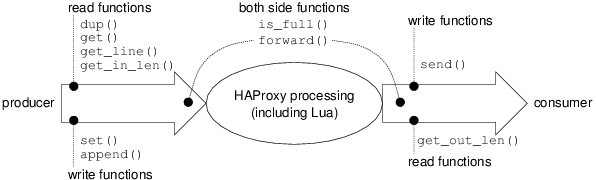

.. toctree::
   :maxdepth: 2

How Lua runs in HAProxy
=======================

HAProxy Lua running contexts
----------------------------

The Lua code executed in HAProxy can be processed in 2 main modes. The first one
is the **initialisation mode**, and the second is the **runtime mode**.

* In the **initialisation mode**, we can perform DNS solves, but we cannot
  perform socket I/O. In this initialisation mode, HAProxy still blocked during
  the execution of the Lua program.

* In the **runtime mode**, we cannot perform DNS solves, but we can use sockets.
  The execution of the Lua code is multiplexed with the requests processing, so
  the Lua code seems to be run in blocking, but it is not the case.

The Lua code is loaded in one or more files. These files contains main code and
functions. Lua have 6 execution context.

1. The Lua file **body context**. It is executed during the load of the Lua file
   in the HAProxy `[global]` section with the directive `lua-load`. It is
   executed in initialisation mode. This section is use for configuring Lua
   bindings in HAProxy.

2. The Lua **init context**. It is an Lua function executed just after the
   HAProxy configuration parsing. The execution is in initialisation mode. In
   this context the HAProxy environment are already initialized. It is useful to
   check configuration, or initializing socket connections or tasks. These
   functions are declared in the body context with the Lua function
   `core.register_init()`. The prototype of the function is a simple function
   without return value and without parameters, like this: `function fcn()`.

3. The Lua **task context**. It is an Lua function executed after the start
   of the HAProxy scheduler, and just after the declaration of the task with the
   Lua function `core.register_task()`. This context can be concurrent with the
   traffic processing. It is executed in runtime mode. The prototype of the
   function is a simple function without return value and without parameters,
   like this: `function fcn()`.

4. The **action context**. It is an Lua function conditionally executed. These
   actions are declared by the HAProxy directives "`tcp-request content lua
   <function>`", "`tcp-response content lua <function>`", "`http-request lua
   <function>`" and "`http-response lua <function>`". The prototype of the
   Lua called function is a function with doesn't returns anything and that take
   an object of class TXN as entry. `function fcn(txn)`

5. The **sample-fetch context**. This function takes a TXN object as entry
   argument and returns a string. These types of function cannot execute any
   blocking function. They are useful to aggregate some of original HAProxy
   sample-fetches and return the result. The prototype of the function is
   `function string fcn(txn)`. These functions can be registered with the Lua
   function `core.register_fetches()`. Each declared sample-fetch is prefixed by
   the string "lua.".

   **NOTE**: It is possible that this function cannot found the required data
   in the original HAProxy sample-fetches, in this case, it cannot return the
   result. This case is not yet supported

6. The **converter context**. It is an Lua function that takes a string as input
   and returns another string as output. These types of function are stateless,
   it cannot access to any context. They don't execute any blocking function.
   The call prototype is `function string fcn(string)`. This function can be
   registered with the Lua function `core.register_converters()`. Each declared
   converter is prefixed by the string "lua.".

HAProxy Lua Hello world
-----------------------

HAProxy configuration file (`hello_world.conf`):

::

    global
       lua-load hello_world.lua

    listen proxy
       bind 127.0.0.1:10001
       tcp-request content lua hello_world

HAProxy Lua file (`hello_world.lua`):

.. code-block:: lua

    function hello_world(txn)
       txn.res:send("hello world\n")
       txn:close()
    end

How to start HAProxy for testing this configuration:

::

    ./haproxy -f hello_world.conf

On other terminal, you can test with telnet:

::

    #:~ telnet 127.0.0.1 10001
    hello world

Core class
==========

.. js:class:: core

   The "core" class contains all the HAProxy core functions. These function are
   useful for the controlling the execution flow, registering hooks, manipulating
   global maps or ACL, ...

   "core" class is basically provided with HAProxy. No `require` line is
   required to uses these function.

   The "core" class is static, t is not possible to create a new object of this
   type.

.. js:attribute:: core.emerg

  This attribute is an integer, it contains the value of the loglevel "emergency" (0).

.. js:attribute:: core.alert

  This attribute is an integer, it contains the value of the loglevel "alert" (1).

.. js:attribute:: core.crit

  This attribute is an integer, it contains the value of the loglevel "critical" (2).

.. js:attribute:: core.err

  This attribute is an integer, it contains the value of the loglevel "error" (3).

.. js:attribute:: core.warning

  This attribute is an integer, it contains the value of the loglevel "warning" (4).

.. js:attribute:: core.notice

  This attribute is an integer, it contains the value of the loglevel "notice" (5).

.. js:attribute:: core.info

  This attribute is an integer, it contains the value of the loglevel "info" (6).

.. js:attribute:: core.debug

  This attribute is an integer, it contains the value of the loglevel "debug" (7).

.. js:function:: core.log(loglevel, msg)

  **context**: body, init, task, action, sample-fetch, converter

  This fucntion sends a log. The log is sent, according with the HAProxy
  configuration file, on the default syslog server if it is configured and on
  the stderr if it is allowed.

  :param integer loglevel: Is the log level asociated with the message. It is a
    number between 0 and 7.
  :param string msg: The log content.
  :see: core.emerg, core.alert, core.crit, core.err, core.warning, core.notice,
    core.info, core.debug (log level definitions)
  :see: code.Debug
  :see: core.Info
  :see: core.Warning
  :see: core.Alert

.. js:function:: core.Debug(msg)

  **context**: body, init, task, action, sample-fetch, converter

  :param string msg: The log content.
  :see: log

  Does the same job than:

.. code-block:: lua

	function Debug(msg)
		core.log(core.debug, msg)
	end
..

.. js:function:: core.Info(msg)

  **context**: body, init, task, action, sample-fetch, converter

  :param string msg: The log content.
  :see: log

.. code-block:: lua

	function Info(msg)
		core.log(core.info, msg)
	end
..

.. js:function:: core.Warning(msg)

  **context**: body, init, task, action, sample-fetch, converter

  :param string msg: The log content.
  :see: log

.. code-block:: lua

	function Warning(msg)
		core.log(core.warning, msg)
	end
..

.. js:function:: core.Alert(msg)

  **context**: body, init, task, action, sample-fetch, converter

  :param string msg: The log content.
  :see: log

.. code-block:: lua

	function Alert(msg)
		core.log(core.alert, msg)
	end
..

.. js:function:: core.add_acl(filename, key)

  **context**: init, task, action, sample-fetch, converter

  Add the ACL *key* in the ACLs list referenced by the file *filename*.

  :param string filename: the filename that reference the ACL entries.
  :param string key: the key which will be added.

.. js:function:: core.del_acl(filename, key)

  **context**: init, task, action, sample-fetch, converter

  Delete the ACL entry referenced by the key *key* in the list of ACLs
  referenced by *filename*.

  :param string filename: the filename that reference the ACL entries.
  :param string key: the key which will be deleted.

.. js:function:: core.del_map(filename, key)

  **context**: init, task, action, sample-fetch, converter

  Delete the map entry indexed with the specified key in the list of maps
  referenced by his filename.

  :param string filename: the filename that reference the map entries.
  :param string key: the key which will be deleted.

.. js:function:: core.msleep(milliseconds)

  **context**: body, init, task, action

  The `core.msleep()` stops the Lua execution between specified milliseconds.

  :param integer milliseconds: the required milliseconds.

.. js:function:: core.register_converters(name, func)

  **context**: body

  Register an Lua function executed as converter. All the registered converters
  can be used in HAProxy with the prefix "lua.". An converter get a string as
  input and return a string as output. The registered function can take up to 9
  values as parameter. All the value are strings.

  :param string name: is the name of the converter.
  :param function func: is the Lua function called to work as converter.

  The prototype of the Lua function used as argument is:

.. code-block:: lua

  function(str, [p1 [, p2 [, ... [, p5]]]])
..

  * **str** (*string*): this is the input value automatically converted in
    string.
  * **p1** .. **p5** (*string*): this is a list of string arguments declared in
    the haroxy configuration file. The number of arguments doesn't exceed 5.
    The order and the nature of these is conventionally choose by the
    developper.

.. js:function:: core.register_fetches(name, func)

  **context**: body

  Register an Lua function executed as sample fetch. All the registered sample
  fetchs can be used in HAProxy with the prefix "lua.". A Lua sample fetch
  return a string as output. The registered function can take up to 9 values as
  parameter. All the value are strings.

  :param string name: is the name of the converter.
  :param function func: is the Lua function called to work as sample fetch.

  The prototype of the Lua function used as argument is:

.. code-block:: lua

    string function(txn, [p1 [, p2 [, ... [, p5]]]])
..

  * **txn** (*class txn*): this is the txn object associated with the current
    request.
  * **p1** .. **p5** (*string*): this is a list of string arguments declared in
    the haroxy configuration file. The number of arguments doesn't exceed 5.
    The order and the nature of these is conventionally choose by the
    developper.
  * **Returns**: A string containing some data, ot nil if the value cannot be
    returned now.

  lua example code:

.. code-block:: lua

    core.register_fetches("hello", function(txn)
        return "hello"
    end)
..

  HAProxy example configuration:

::

    frontend example
       http-request redirect location /%[lua.hello]

.. js:function:: core.register_init(func)

  **context**: body

  Register a function executed after the configuration parsing. This is useful
  to check any parameters.

  :param fuction func: is the Lua function called to work as initializer.

  The prototype of the Lua function used as argument is:

.. code-block:: lua

    function()
..

  It takes no input, and no output is expected.

.. js:function:: core.register_task(func)

  **context**: body, init, task, action, sample-fetch, converter

  Register and start independent task. The task is started when the HAProxy
  main scheduler starts. For example this type of tasks can be executed to
  perform complex health checks.

  :param fuction func: is the Lua function called to work as initializer.

  The prototype of the Lua function used as argument is:

.. code-block:: lua

    function()
..

  It takes no input, and no output is expected.

.. js:function:: core.set_nice(nice)

  **context**: task, action, sample-fetch, converter

  Change the nice of the current task or current session.

  :param integer nice: the nice value, it must be between -1024 and 1024.

.. js:function:: core.set_map(filename, key, value)

  **context**: init, task, action, sample-fetch, converter

  set the value *value* associated to the key *key* in the map referenced by
  *filename*.

.. js:function:: core.sleep(int seconds)

  **context**: body, init, task, action

  The `core.sleep()` functions stop the Lua execution between specified seconds.

  :param integer seconds: the required seconds.

.. js:function:: core.tcp()

  **context**: init, task, action

  This function returns a new object of a *socket* class.

  :returns: A socket class object.

.. js:function:: core.yield()

  **context**: task, action, sample-fetch, converter

  Give back the hand at the HAProxy scheduler. It is used when the LUA
  processing consumes a lot of processing time.

Fetches class
=============

.. js:class:: Fetches

  This class contains a lot of internal HAProxy sample fetches. See the
  HAProxy "configuration.txt" documentation for more information about her
  usage. they are the chapters 7.3.2 to 7.3.6.

  :see: TXN.f
  :see: TXN.sf

  Fetches are useful for:

  * get system time,
  * get environment variable,
  * get random numbers,
  * known backend status like the number of users in queue or the number of
    connections established,
  * client information like ip source or destination,
  * deal with stick tables,
  * Established SSL informations,
  * HTTP information like headers or method.

.. code-block:: lua

	function action(txn)
		-- Get source IP
		local clientip = txn.f:src()
	end
..

Converters class
================

.. js:class:: Converters

  This class contains a lot of internal HAProxy sample converters. See the
  HAProxy documentation "configuration.txt" for more information about her
  usage. Its the chapter 7.3.1.

  :see: TXN.c
  :see: TXN.sc

  Converters provides statefull transformation. They are useful for:

  * converting input to base64,
  * applying hash on input string (djb2, crc32, sdbm, wt6),
  * format date,
  * json escape,
  * extracting prefered language comparing two lists,
  * turn to lower or upper chars,
  * deal with stick tables.

Channel class
=============

.. js:class:: Channel

  HAProxy uses two buffers for the processing of the requests. The first one is
  used with the request data (from the client to the server) and the second is
  used for the response data (from the server to the client).

  Each buffer contains two types of data. The first type is the incoming data
  waiting for a processing. The second part is the outgoing data already
  processed. Usually, the incoming data is processed, after it is tagged as
  outgoing data, and finally it is sent. The following functions provides tools
  for manipulating these data in a buffer.

  The following diagram shows where the channel class function are applied.

  **Warning**: It is not possible to read from the response in request action,
  and it is not possible to read for the request channel in response action.

.. js:function:: Channel.dup(channel)

  This function returns a string that contain the entire buffer. The data is
  not remove from the buffer and can be reprocessed later.

  If the buffer cant receive more data, a 'nil' value is returned.

  :param class_channel channel: The manipulated Channel.
  :returns: a string containig all the avalaible data or nil.

.. js:function:: Channel.get(channel)

  This function returns a string that contain the entire buffer. The data is
  consumed from the buffer.

  If the buffer cant receive more data, a 'nil' value is returned.

  :param class_channel channel: The manipulated Channel.
  :returns: a string containig all the avalaible data or nil.

.. js:function:: Channel.get_line(channel)

  This function returns a string that contain the first line of the buffer. The
  data is consumed. If the data returned doesn't contains a final '\n' its
  assumed than its the last available data in the buffer.

  If the buffer cant receive more data, a 'nil' value is returned.

  :param class_channel channel: The manipulated Channel.
  :returns: a string containig the avalaiable line or nil.

.. js:function:: Channel.set(channel, string)

  This function replace the content of the buffer by the string. The function
  returns the copied length, otherwise, it returns -1.

  The data set with this function are not send. They wait for the end of
  HAProxy processing, so the buffer can be full.

  :param class_channel channel: The manipulated Channel.
  :param string string: The data which will sent.
  :returns: an integer containing the amount of butes copyed or -1.

.. js:function:: Channel.append(channel, string)

  This function append the string argument to the content of the buffer. The
  function returns the copied length, otherwise, it returns -1.

  The data set with this function are not send. They wait for the end of
  HAProxy processing, so the buffer can be full.

  :param class_channel channel: The manipulated Channel.
  :param string string: The data which will sent.
  :returns: an integer containing the amount of butes copyed or -1.

.. js:function:: Channel.send(channel, string)

  This function required immediate send of the data. Unless if the connection
  is close, the buffer is regularly flushed and all the string can be sent.

  :param class_channel channel: The manipulated Channel.
  :param string string: The data which will sent.
  :returns: an integer containing the amount of butes copyed or -1.

.. js:function:: Channel.get_in_length(channel)

  This function returns the length of the input part of the buffer.

  :param class_channel channel: The manipulated Channel.
  :returns: an integer containing the amount of avalaible bytes.

.. js:function:: Channel.get_out_length(channel)

  This function returns the length of the output part of the buffer.

  :param class_channel channel: The manipulated Channel.
  :returns: an integer containing the amount of avalaible bytes.

.. js:function:: Channel.forward(channel, int)

  This function transfer bytes from the input part of the buffer to the output
  part.

  :param class_channel channel: The manipulated Channel.
  :param integer int: The amount of data which will be forwarded.

HTTP class
==========

.. js:class:: HTTP

   This class contain all the HTTP manipulation functions.

.. js:function:: HTTP.req_get_header(http)

  Returns an array containing all the request headers.

  :param class_http http: The related http object.
  :returns: array of headers.
  :see: HTTP.res_get_header()

.. js:function:: HTTP.res_get_header(http)

  Returns an array containing all the response headers.

  :param class_http http: The related http object.
  :returns: array of headers.
  :see: HTTP.req_get_header()

.. js:function:: HTTP.req_add_header(http, name, value)

  Appends an HTTP header field in the request whose name is
  specified in "name" and whose value is defined in "value".

  :param class_http http: The related http object.
  :param string name: The header name.
  :param string value: The header value.
  :see: HTTP.res_add_header()

.. js:function:: HTTP.res_add_header(http, name, value)

  appends an HTTP header field in the response whose name is
  specified in "name" and whose value is defined in "value".

  :param class_http http: The related http object.
  :param string name: The header name.
  :param string value: The header value.
  :see: HTTP.req_add_header()

.. js:function:: HTTP.req_del_header(http, name)

  Removes all HTTP header fields in the request whose name is
  specified in "name".

  :param class_http http: The related http object.
  :param string name: The header name.
  :see: HTTP.res_del_header()

.. js:function:: HTTP.res_del_header(http, name)

  Removes all HTTP header fields in the response whose name is
  specified in "name".

  :param class_http http: The related http object.
  :param string name: The header name.
  :see: HTTP.req_del_header()

.. js:function:: HTTP.req_set_header(http, name, value)

  This variable replace all occurence of all header "name", by only
  one containing the "value".

  :param class_http http: The related http object.
  :param string name: The header name.
  :param string value: The header value.
  :see: HTTP.res_set_header()

  This function does the same work as the folowwing code:

.. code-block:: lua

   function fcn(txn)
      TXN.http:req_del_header("header")
      TXN.http:req_add_header("header", "value")
   end
..

.. js:function:: HTTP.res_set_header(http, name, value)

  This variable replace all occurence of all header "name", by only
  one containing the "value".

  :param class_http http: The related http object.
  :param string name: The header name.
  :param string value: The header value.
  :see: HTTP.req_set_header()

.. js:function:: HTTP.req_replace_header(http, name, regex, replace)

  Matches the regular expression in all occurrences of header field "name"
  according to "regex", and replaces them with the "replace" argument. The
  replacement value can contain back references like \1, \2, ... This
  function works with the request.

  :param class_http http: The related http object.
  :param string name: The header name.
  :param string regex: The match regular expression.
  :param string replace: The replacement value.
  :see: HTTP.res_replace_header()

.. js:function:: HTTP.res_replace_header(http, name, regex, string)

  Matches the regular expression in all occurrences of header field "name"
  according to "regex", and replaces them with the "replace" argument. The
  replacement value can contain back references like \1, \2, ... This
  function works with the request.

  :param class_http http: The related http object.
  :param string name: The header name.
  :param string regex: The match regular expression.
  :param string replace: The replacement value.
  :see: HTTP.req_replace_header()

.. js:function:: HTTP.req_replace_value(http, name, regex, replace)

  Works like "HTTP.req_replace_header()" except that it matches the regex
  against every comma-delimited value of the header field "name" instead of the
  entire header.

  :param class_http http: The related http object.
  :param string name: The header name.
  :param string regex: The match regular expression.
  :param string replace: The replacement value.
  :see: HTTP.req_replace_header()
  :see: HTTP.res_replace_value()

.. js:function:: HTTP.res_replace_value(http, name, regex, replace)

  Works like "HTTP.res_replace_header()" except that it matches the regex
  against every comma-delimited value of the header field "name" instead of the
  entire header.

  :param class_http http: The related http object.
  :param string name: The header name.
  :param string regex: The match regular expression.
  :param string replace: The replacement value.
  :see: HTTP.res_replace_header()
  :see: HTTP.req_replace_value()

.. js:function:: HTTP.req_set_method(http, method)

  Rewrites the request method with the parameter "method".

  :param class_http http: The related http object.
  :param string method: The new method.

.. js:function:: HTTP.req_set_path(http, path)

  Rewrites the request path with the "path" parameter.

  :param class_http http: The related http object.
  :param string path: The new path.

.. js:function:: HTTP.req_set_query(http, query)

  Rewrites the request's query string which appears after the first question
  mark ("?") with the parameter "query".

  :param class_http http: The related http object.
  :param string query: The new query.

.. js:function:: HTTP.req.set_uri(http, uri)

  Rewrites the request URI with the parameter "uri".

  :param class_http http: The related http object.
  :param string uri: The new uri.

TXN class
=========

.. js:class:: TXN

  The txn class contain all the functions relative to the http or tcp
  transaction (Note than a tcp stream is the same than a tcp transaction, but
  an HTTP transaction is not the same than a tcp stream).

  The usage of this class permits to retrieve data from the requests, alter it
  and forward it.

  All the functions provided by this class are available in the context
  **sample-fetches** and **actions**.

.. js:attribute:: TXN.c

  This attribute contains a Converters class object.

.. js:attribute:: TXN.sc

  This attribute contains a Converters class object. The functions of
  this object returns always a string.

.. js:attribute:: TXN.f

  This attribute contains a Fetches class object.

.. js:attribute:: TXN.sf

  This attribute contains a Fetches class object. The functions of
  this object returns always a string.

.. js:attribute:: TXN.req

  This attribute contains a channel class object for the request buffer.

.. js:attribute:: TXN.res

  This attribute contains a channel class object for the response buffer.

.. js:attribute:: TXN.http

  This attribute contains an HTTP class object. It is avalaible only if the
  proxy has the "mode http" enabled.

.. js:function:: TXN.log(TXN, loglevel, msg)

  This function sends a log. The log is sent, according with the HAProxy
  configuration file, on the default syslog server if it is configured and on
  the stderr if it is allowed.

  :param class_txn txn: The class txn object containing the data.
  :param integer loglevel: Is the log level asociated with the message. It is a
    number between 0 and 7.
  :param string msg: The log content.
  :see: core.emerg, core.alert, core.crit, core.err, core.warning, core.notice,
    core.info, core.debug (log level definitions)
  :see: TXN.deflog
  :see: TXN.Debug
  :see: TXN.Info
  :see: TXN.Warning
  :see: TXN.Alert

.. js:function:: TXN.deflog(TXN, msg)

  Sends a log line with the default loglevel for the proxy ssociated with the
  transaction.

  :param class_txn txn: The class txn object containing the data.
  :param string msg: The log content.
  :see: TXN.log

.. js:function:: TXN.Debug(txn, msg)

  :param class_txn txn: The class txn object containing the data.
  :param string msg: The log content.
  :see: TXN.log

  Does the same job than:

.. code-block:: lua

	function Debug(txn, msg)
		TXN.log(txn, core.debug, msg)
	end
..

.. js:function:: TXN.Info(txn, msg)

  :param class_txn txn: The class txn object containing the data.
  :param string msg: The log content.
  :see: TXN.log

.. code-block:: lua

	function Debug(txn, msg)
		TXN.log(txn, core.info, msg)
	end
..

.. js:function:: TXN.Warning(txn, msg)

  :param class_txn txn: The class txn object containing the data.
  :param string msg: The log content.
  :see: TXN.log

.. code-block:: lua

	function Debug(txn, msg)
		TXN.log(txn, core.warning, msg)
	end
..

.. js:function:: TXN.Alert(txn, msg)

  :param class_txn txn: The class txn object containing the data.
  :param string msg: The log content.
  :see: TXN.log

.. code-block:: lua

	function Debug(txn, msg)
		TXN.log(txn, core.alert, msg)
	end
..

.. js:function:: TXN.get_priv(txn)

  Return Lua data stored in the current transaction (with the `TXN.set_priv()`)
  function. If no data are stored, it returns a nil value.

  :param class_txn txn: The class txn object containing the data.
  :returns: the opaque data previsously stored, or nil if nothing is
     avalaible.

.. js:function:: TXN.set_priv(txn, data)

  Store any data in the current HAProxy transaction. This action replace the
  old stored data.

  :param class_txn txn: The class txn object containing the data.
  :param opaque data: The data which is stored in the transaction.

.. js:function:: TXN.set_var(TXN, var, value)

  Converts an Lua type in a HAProxy type and store it in a variable <var>.

  :param class_txn txn: The class txn object containing the data.
  :param string var: The variable name according with the HAProxy variable syntax.
  :param opaque value: The data which is stored in the variable.

.. js:function:: TXN.get_var(TXN, var)

  Returns data stored in the variable <var> converter in Lua type.

  :param class_txn txn: The class txn object containing the data.
  :param string var: The variable name according with the HAProxy variable syntax.

.. js:function:: TXN.get_headers(txn)

  This function returns an array of headers.

  :param class_txn txn: The class txn object containing the data.
  :returns: an array of headers.

.. js:function:: TXN.close(txn)

  This function close the transaction and the associated session. It can be
  used when a critical error is detected.

  :param class_txn txn: The class txn object containing the data.

.. js:function:: TXN.set_loglevel(txn, loglevel)

  Is used to change the log level of the current request. The "loglevel" must
  be an integer between 0 and 7.

  :param class_txn txn: The class txn object containing the data.
  :param integer loglevel: The required log level. This variable can be one of
  :see: core.<loglevel>

.. js:function:: TXN.set_tos(txn, tos)

  Is used to set the TOS or DSCP field value of packets sent to the client to
  the value passed in "tos" on platforms which support this.

  :param class_txn txn: The class txn object containing the data.
  :param integer tos: The new TOS os DSCP.

.. js:function:: TXN.set_mark(txn, mark)

  Is used to set the Netfilter MARK on all packets sent to the client to the
  value passed in "mark" on platforms which support it.

  :param class_txn txn: The class txn object containing the data.
  :param integer mark: The mark value.

Socket class
============

.. js:class:: Socket

  This class must be compatible with the Lua Socket class. Only the 'client'
  functions are available. See the Lua Socket documentation:

  `http://w3.impa.br/~diego/software/luasocket/tcp.html
  <http://w3.impa.br/~diego/software/luasocket/tcp.html>`_

.. js:function:: Socket.close(socket)

  Closes a TCP object. The internal socket used by the object is closed and the
  local address to which the object was bound is made available to other
  applications. No further operations (except for further calls to the close
  method) are allowed on a closed Socket.

  :param class_socket socket: Is the manipulated Socket.

  Note: It is important to close all used sockets once they are not needed,
  since, in many systems, each socket uses a file descriptor, which are limited
  system resources. Garbage-collected objects are automatically closed before
  destruction, though.

.. js:function:: Socket.connect(socket, address, port)

  Attempts to connect a socket object to a remote host.

  Address can be an IP address or a host name. Port must be an integer number
  in the range [1..64K).

  In case of error, the method returns nil followed by a string describing the
  error. In case of success, the method returns 1.

  :param class_socket socket: Is the manipulated Socket.
  :returns: 1 or nil.

  Note: The function Socket.connect is available and is a shortcut for the
  creation of client sockets.

  Note: Starting with LuaSocket 2.0, the settimeout method affects the behavior
  of connect, causing it to return with an error in case of a timeout. If that
  happens, you can still call Socket.select with the socket in the sendt table.
  The socket will be writable when the connection is established.

.. js:function:: Socket.connect_ssl(socket, address, port)

  Same behavior than the function socket:connect, but uses SSL.

  :param class_socket socket: Is the manipulated Socket.
  :returns: 1 or nil.

.. js:function:: Socket.getpeername(socket)

  Returns information about the remote side of a connected client object.

  Returns a string with the IP address of the peer, followed by the port number
  that peer is using for the connection. In case of error, the method returns
  nil.

  :param class_socket socket: Is the manipulated Socket.
  :returns: a string containing the server information.

.. js:function:: Socket.getsockname(socket)

  Returns the local address information associated to the object.

  The method returns a string with local IP address and a number with the port.
  In case of error, the method returns nil.

  :param class_socket socket: Is the manipulated Socket.
  :returns: a string containing the client information.

.. js:function:: Socket.receive(socket, [pattern [, prefix]])

  Reads data from a client object, according to the specified read pattern.
  Patterns follow the Lua file I/O format, and the difference in performance
  between all patterns is negligible.

  :param class_socket socket: Is the manipulated Socket.
  :param string|integer pattern: Describe what is required (see below).
  :param string prefix: A string which will be prefix the returned data.
  :returns:  a string containing the required data or nil.

  Pattern can be any of the following:

  * **`*a`**: reads from the socket until the connection is closed. No
              end-of-line translation is performed;

  * **`*l`**: reads a line of text from the Socket. The line is terminated by a
              LF character (ASCII 10), optionally preceded by a CR character
              (ASCII 13). The CR and LF characters are not included in the
              returned line.  In fact, all CR characters are ignored by the
              pattern. This is the default pattern.

  * **number**: causes the method to read a specified number of bytes from the
                Socket. Prefix is an optional string to be concatenated to the
                beginning of any received data before return.

  If successful, the method returns the received pattern. In case of error, the
  method returns nil followed by an error message which can be the string
  'closed' in case the connection was closed before the transmission was
  completed or the string 'timeout' in case there was a timeout during the
  operation. Also, after the error message, the function returns the partial
  result of the transmission.

  Important note: This function was changed severely. It used to support
  multiple patterns (but I have never seen this feature used) and now it
  doesn't anymore.  Partial results used to be returned in the same way as
  successful results. This last feature violated the idea that all functions
  should return nil on error.  Thus it was changed too.

.. js:function:: Socket.send(socket, data [, start [, end ]])

  Sends data through client object.

  :param class_socket socket: Is the manipulated Socket.
  :param string data: The data that will be sent.
  :param integer start: The start position in the buffer of the data which will
   be sent.
  :param integer end: The end position in the buffer of the data which will
   be sent.
  :returns: see below.

  Data is the string to be sent. The optional arguments i and j work exactly
  like the standard string.sub Lua function to allow the selection of a
  substring to be sent.

  If successful, the method returns the index of the last byte within [start,
  end] that has been sent. Notice that, if start is 1 or absent, this is
  effectively the total number of bytes sent. In case of error, the method
  returns nil, followed by an error message, followed by the index of the last
  byte within [start, end] that has been sent. You might want to try again from
  the byte following that. The error message can be 'closed' in case the
  connection was closed before the transmission was completed or the string
  'timeout' in case there was a timeout during the operation.

  Note: Output is not buffered. For small strings, it is always better to
  concatenate them in Lua (with the '..' operator) and send the result in one
  call instead of calling the method several times.

.. js:function:: Socket.setoption(socket, option [, value])

  Just implemented for compatibility, this cal does nothing.

.. js:function:: Socket.settimeout(socket, value [, mode])

  Changes the timeout values for the object. All I/O operations are blocking.
  That is, any call to the methods send, receive, and accept will block
  indefinitely, until the operation completes. The settimeout method defines a
  limit on the amount of time the I/O methods can block. When a timeout time
  has elapsed, the affected methods give up and fail with an error code.

  The amount of time to wait is specified as the value parameter, in seconds.

  The timeout modes are bot implemented, the only settable timeout is the
  inactivity time waiting for complete the internal buffer send or waiting for
  receive data.

  :param class_socket socket: Is the manipulated Socket.
  :param integer value: The timeout value.

Map class
=========

.. js:class:: Map

  This class permits to do some lookup in HAProxy maps. The declared maps can
  be modified during the runtime throught the HAProxy management socket.

.. code-block:: lua

	default = "usa"

	-- Create and load map
	geo = Map.new("geo.map", Map.ip);

	-- Create new fetch that returns the user country
	core.register_fetches("country", function(txn)
		local src;
		local loc;

		src = txn.f:fhdr("x-forwarded-for");
		if (src == nil) then
			src = txn.f:src()
			if (src == nil) then
				return default;
			end
		end

		-- Perform lookup
		loc = geo:lookup(src);

		if (loc == nil) then
			return default;
		end

		return loc;
	end);

.. js:attribute:: Map.int

  See the HAProxy configuration.txt file, chapter "Using ACLs and fetching
  samples" ans subchapter "ACL basics" to understand this pattern matching
  method.

.. js:attribute:: Map.ip

  See the HAProxy configuration.txt file, chapter "Using ACLs and fetching
  samples" ans subchapter "ACL basics" to understand this pattern matching
  method.

.. js:attribute:: Map.str

  See the HAProxy configuration.txt file, chapter "Using ACLs and fetching
  samples" ans subchapter "ACL basics" to understand this pattern matching
  method.

.. js:attribute:: Map.beg

  See the HAProxy configuration.txt file, chapter "Using ACLs and fetching
  samples" ans subchapter "ACL basics" to understand this pattern matching
  method.

.. js:attribute:: Map.sub

  See the HAProxy configuration.txt file, chapter "Using ACLs and fetching
  samples" ans subchapter "ACL basics" to understand this pattern matching
  method.

.. js:attribute:: Map.dir

  See the HAProxy configuration.txt file, chapter "Using ACLs and fetching
  samples" ans subchapter "ACL basics" to understand this pattern matching
  method.

.. js:attribute:: Map.dom

  See the HAProxy configuration.txt file, chapter "Using ACLs and fetching
  samples" ans subchapter "ACL basics" to understand this pattern matching
  method.

.. js:attribute:: Map.end

  See the HAProxy configuration.txt file, chapter "Using ACLs and fetching
  samples" ans subchapter "ACL basics" to understand this pattern matching
  method.

.. js:attribute:: Map.reg

  See the HAProxy configuration.txt file, chapter "Using ACLs and fetching
  samples" ans subchapter "ACL basics" to understand this pattern matching
  method.

.. js:function:: Map.new(file, method)

  Creates and load a map.

  :param string file: Is the file containing the map.
  :param integer method: Is the map pattern matching method. See the attributes
    of the Map class.
  :returns: a class Map object.
  :see: The Map attributes.

.. js:function:: Map.lookup(map, str)

  Perform a lookup in a map.

  :param class_map map: Is the class Map object.
  :param string str: Is the string used as key.
  :returns: a string containing the result or nil if no match.

.. js:function:: Map.slookup(map, str)

  Perform a lookup in a map.

  :param class_map map: Is the class Map object.
  :param string str: Is the string used as key.
  :returns: a string containing the result or empty string if no match.

External Lua libraries
======================

A lot of useful lua libraries can be found here:

* `https://lua-toolbox.com/ <https://lua-toolbox.com/>`_

Redis acces:

* `https://github.com/nrk/redis-lua <https://github.com/nrk/redis-lua>`_

This is an example about the usage of the Redis library with HAProxy. Note that
each call of any function of this library can throw an error if the socket
connection fails.

.. code-block:: lua

    -- load the redis library
    local redis = require("redis");

    function do_something(txn)

       -- create and connect new tcp socket
       local tcp = core.tcp();
       tcp:settimeout(1);
       tcp:connect("127.0.0.1", 6379);

       -- use the redis library with this new socket
       local client = redis.connect({socket=tcp});
       client:ping();

    end

OpenSSL:

* `http://mkottman.github.io/luacrypto/index.html
  <http://mkottman.github.io/luacrypto/index.html>`_

* `https://github.com/brunoos/luasec/wiki
  <https://github.com/brunoos/luasec/wiki>`_

